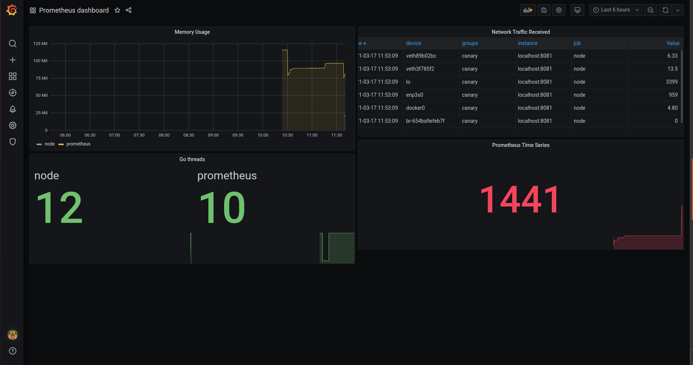

# Prometheus Up & Running Book Summary

## What is Prometheus

Four ways of reducing data volume:
- Profiling
- Tracing
- Logging
- Metrics

### Prometheus Architecture

Componentes of Prometheus architecture:
- Client libraries
- Exporter
- Service discovery
- Scraping
- Storage
- Dashboard
- Recording rules and alerts
- Alert management

## Instrumentation
 Instrumentation is the use of a library in an application's code base in order to expose and update metrics about it for a Prometheus instance to scrape.


### The Gauge
- Gauges are a snapshot of some current state. 
- Examples of gauges include:
    - the number of items in the queue
    - memory usage of a cache
    - number of active threads
    - the last time a record was processed

- Gauges have three main methods: inc, dec and set.

### The Histogram
- A histogram is a set of buckets, such as 1ms, 2ms, 5ms, 10ms, that track the numbers of events that fall into each bucket. The histogram_quantile PromQL function can calculate a quantile from the buckets.

### Unit Testing Instrumentation
A sample code snippet for unit testing a prometheus counter.

<details>
<summary>unit_test.go</summary>

```
package main

import (
	"testing"

	"github.com/prometheus/client_golang/prometheus"
	dto "github.com/prometheus/client_model/go"
	"github.com/stretchr/testify/assert"
)

var (
	foos = prometheus.NewCounter(prometheus.CounterOpts{
		Name: "foos_total",
		Help: "The number of foo calls",
	})
	reg = prometheus.NewRegistry()
)

func Foo() {
	foos.Inc()
}

func getMetricValue(col prometheus.Collector) float64 {
	c := make(chan prometheus.Metric, 1) // 1 for metric with no vector
	col.Collect(c)                       // collect current metric value into the channel
	m := dto.Metric{}
	_ = (<-c).Write(&m) // read metric value from the channel
	return *m.Counter.Value
}

func TestFoo(t *testing.T) {
	reg.MustRegister(foos)
	before := getMetricValue(foos)
	Foo()
	after := getMetricValue(foos)
	assert.Equal(t, 1, int(after-before))
}

```
</details>

## Exposition
The process of making metrics available to Prometheus is
known as exposition. Exposition to Prometheus is done over HTTP by using "/metrics" path.

## Labels
Labels are key-value pairs associated with time series, that in addition to the metric name, uniquely identify them.


### Instrumentation and Target Labels

- Labels come from two sources, instrumentation labels and target labels.
- Instrumentation labels, as the name suggest, come from the instrumentation labels. 
- Target labels identify a specific monitoring target that Prometheus scraps.


An example for counter with label:

<details>
<summary> counter_with_label.go </summary>

```
package main

import (
	"log"
	"net/http"

	"github.com/gorilla/mux"
	"github.com/prometheus/client_golang/prometheus"
	"github.com/prometheus/client_golang/prometheus/promhttp"
)

var (
	requests = prometheus.NewCounterVec(prometheus.CounterOpts{
		Name: "api_call_counts",
		Help: "The number of api calls",
	}, []string{"path"})
)

func main() {
	router := mux.NewRouter()
	reg := prometheus.NewRegistry()
	reg.MustRegister(requests)

	router.HandleFunc("/api/{path}", func(res http.ResponseWriter, req *http.Request) {
		vars := mux.Vars(req)
		path := vars["path"]
		requests.WithLabelValues(path).Inc()
		res.WriteHeader(http.StatusOK)
		res.Write([]byte(path))
	})
	router.HandleFunc("/", func(res http.ResponseWriter, req *http.Request) {
		requests.WithLabelValues("/").Inc()
		res.WriteHeader(http.StatusOK)
		res.Write([]byte("Hello from homepage"))

	})

	router.Handle("/metrics", promhttp.HandlerFor(reg, promhttp.HandlerOpts{}))
	server := http.Server{
		Addr:    ":8085",
		Handler: router,
	}
	log.Println("Server is running")
	log.Fatal(server.ListenAndServe())
}
```

</details>


### Metrics
```
# HELP latency_seconds Latency in seconds.
# TYPE latency_seconds summary
latency_seconds_sum{path="/foo"} 1.0
latency_seconds_count{path="/foo"} 2.0
```
Here latency_seconds is a metric family. latency_seconds_sum is a time series.

### Child
- The value returned to you by the labels method is called a child

### Aggregating
- Aggregation is a technique which allows run query on some specific time series data.


### Labels Patterns
Prometheus only supports 64-bit floating-point numbers as time series values, not any other data types such as strings. But label values are strings, and there are certain limited use cases where it is okay to (ab)use them without getting too far into logs-based monitoring.
- Enum: Enum is a string value which can be used as labels in gauge.
- Info: Info metrics are useful for annota‐
tions such as version numbers and other build information that would be useful to
query on, but it doesn’t make sense to use them as target labels

### When to use labels
- The rule of thumb is that either summing or averaging across a metric should produce a meaningful result. 
- Another thing to avoid is having a time series that is a total of the rest of the metric.


### Cardinality
- In Prometheus, Cardinality is the nunber of time series you have. 
- The rule of thumbs writer used is that the cardinality of an arbitary metrics in one application instance should be kept below ten.


## Dashboarding with Grafana
An example dashboard in grafana.




## Service Discovery

Service discovery in Prometheus is to introduce the scrape target. It is all about to tell to Prometheus from where to scrape.

### Service Discovery Mechanisms

#### Static
An example of static service discovery to have Prometheus scrape itself.

```
scrape_configs:
  - job_name: prometheus
	static_configs:
      - targets:
         - localhost:9090
```


#### File

An example of service discovery using json file is given below:


<details>

<summary>filesd.json</summary>


```
[
    {
        "targets": ["localhost:9090"],
        "labels": {
            "team": "monitoring",
            "job": "prometheus"
        }
    },
    {
        "targets": [ "localhost:8081", "localhost:8085" ],
        "labels": {
            "team": "infra",
            "job": "node"
        }
    }
]

```


</details>

### Relabelling
- Relabelling can be used to map from metadata to target.

- ```relabel_config``` is used in the config file for relabelling meta data to target.

An example of relabelling to keep relabel action to only monitor targets with a team="infra":

```
scrape_configs:
 - job_name: file
   file_sd_configs:
    - files:
      - '*.json'
	relabel_configs:
	 - source_labels: [team]
	   regex: infra
	   action: keep
```

### Target Labels

- Target Labels are labels that are added to the labels of every time series returned from a scrape. They are the identity of the target. 


#### Replace
- Replace action can be used to relabel the service metadata to the expected target label.

#### job, instance, and ```__address__```

- By default there are some common target labels. They are job & instance. If the target has no instance label, it is defaulted to the value of the address label from service metadata.


## Introduction to PromQL

PromQL is the Prometheus Query Language. 

### Gauge

PromQL for Gauge:
- sum
- average 
- minimum
- maximum

Another one is without to skip some labels.

Examples:
- sum without(device, fstype, mountpoint)(node_filesystem_size_bytes)
- max without(device, fstype, mountpoint)(node_filesystem_size_bytes)
- min (node_filesystem_size_bytes)
- avg (node_filesystem_size_bytes)

### Counter

- Counter tracts the number or size of events, and the value of the applications expose on thier "/metrics" path is the total since it started.

- As counter is increasing over time, rate function is used to see the rate of change for a specific time bound. Example: rate(node_network_receive_bytes_total[5m]) will show the result of the amount of traffic received per second over the last 5 minutes.

- The output of rate is a gauge, so the same aggregations apply as for gauges.

### Summary

- A summary metric will usually contain both a _sum and _count. The _sum and _count are both counters. As both are counters, before aggregating rate must be used.

- For example, prometheus exposes a http_response_size_bytes summary where http_response_size_bytes_count tracks the number of requests. Similarly, http_response_size_bytes_sum is a counter with the number of bytes of each handle has returned. 


Examples:

```
sum without(handler)(rate(http_response_size_bytes_count[5m]))

sum without(handler)(rate(http_response_size_bytes_sum[5m]))
```
N.B. To get the average we can use division for avobe results.


### Histogram

- Histogram metrics allow to track the distribution of the size of events, allowing to calculate quantiles from them. For example, histogram can be used to calculate the 0.9 quantile latency.

- Histogram metric has time series with a _bucket suffix. Each bucket has a le label, which a counter of howq many events have a size less than or equal to the bucket boundary. 

- Histogram metrics also include _sum and _count metrics, which is exactly same as for the summary metric.

Example:

```
histogram_quantile(
0.90,
rate(prometheus_tsdb_compaction_duration_seconds_bucket[1d]))
```

### Selectors

Selectors is used to limit the labels. Like ```process_resident_memory_bytes{job="node"}``` is a selector that will return all time series with the name process_resident_memory_bytes and a job label of node. Here job="node" is called a matcher.

- Matchers: There are four matchers:
	- = is the equality based matcher
	- != is the negative equality matcher
	- =~ is the regular expression matcher
	- !~ is the negative regular expression matcher

- Instant Vector: An instant vector selector returns an instant vector of the most recent samples before the query evaluation time.

- Range Vector: Unlike an instant vector selector which returns one sample per time series, a range vector selector can return many samples for each time series. Range vectors are always used with the rate function.

- Offset: Offset allows to take the evaluation time for a query. For example: ```process_resident_memory_bytes{job="node"} offset 1h``` would get memory usage an hour before the query evaluation time.

### HTTP API
Prometheus offers a number of HTTP APIs. All the endpoints of interest are under /api/v1.

- query: The query endpoint or more formally ```/api/v1/query``` executes a PromQL expression at a given time and returns the result.

A sample query and the corresponding output is given below:

<details>

<summary>Example</summary>

```
Query url: http://localhost:9090/api/v1/query?query=process_resident_memory_bytes

Response: 

{
    "status": "success",
    "data": {
        "resultType": "vector",
        "result": [
            {
                "metric": {
                    "__name__": "process_resident_memory_bytes",
                    "instance": "localhost:8081",
                    "job": "node",
                    "team": "infra"
                },
                "value": [
                    1616061038.935,
                    "24301568"
                ]
            },
            {
                "metric": {
                    "__name__": "process_resident_memory_bytes",
                    "instance": "localhost:9090",
                    "job": "prometheus",
                    "team": "monitoring"
                },
                "value": [
                    1616061038.935,
                    "160964608"
                ]
            }
        ]
    }
}

```

</details>

- query_range: The query range endpoint at ```/api/v1/query_range``` is the main http endpoint of Prometheus as it is the endpoint to use for graphing.


## Resources:
- [Prometheus documentation](https://prometheus.io/docs/prometheus/latest/getting_started/)
- [Introduction to Prometheus](https://www.youtube.com/watch?v=ZtYMuxAj7EU)
- [Prometheus Architecture Explained](https://www.youtube.com/watch?v=h4Sl21AKiDg&t=1s)
- [Prometheus Tutorial by Edureka](https://www.youtube.com/watch?v=7gW5pSM6dlU)
- [Setup Prometheus monitoring on kubernetes using helm and prometheus operator | Part-1](https://www.youtube.com/watch?v=QoDqxm7ybLc)
- [Prometheus Monitoring - Steps to monitor third-party apps using Prometheus Exporter | Part-2](https://www.youtube.com/watch?v=mLPg49b33sA)
- [Prometheus blog series](https://blog.pvincent.io/2017/12/prometheus-blog-series-part-1-metrics-and-labels/)


