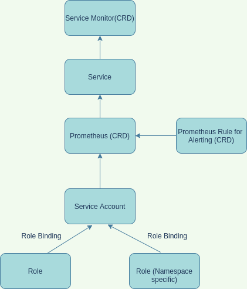
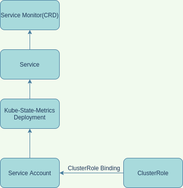

# Kube-Prometheus

## Custom Resource Definitions List

- AlertmanagerConfig: AlertmanagerConfig defines a namespaced AlertmanagerConfig to be aggregated across multiple namespaces configuring one Alertmanager cluster.

- Alertmanager: Alertmanager describes an Alertmanager cluster.

- PodMonitor: PodMonitoring defines monitoring for a set of pods.

- Probe: Probe defines monitoring for a set of static targets or ingresses.

- Prometheus: Prometheus defines a Prometheus deployment.

- PrometheusRule: PrometheusRule defines recording and alerting rules for a Prometheus instance.

- ServiceMonitor: ServiceMonitor defines monitoring for a set of services.

- ThanosRuler: ThanosRulern defines a ThanosRuler deployment.

## Components List

- Alert Manager

- Blackbox exporter

- Grafana (Dashboard & Deployment)

- Service Monitor

- Exporter (Node exporter, kube-state-metrics, blackbox exporter)

- Prometheus Adapter

- Prometheus Operator

- Prometheus Server

## Component High Level Architecture

## Prometheus Custom Resource Definition

- Prometheus Custom Resource deploy Prometheus server in stateful set.

- It manifest file consists of apiVersion, kind, metadata, spec.

prometheus manifest file

apiVersion: monitoring.coreos.com/v1
kind: Prometheus
metadata:
  labels:
    app.kubernetes.io/component: prometheus
    app.kubernetes.io/name: prometheus
    app.kubernetes.io/part-of: kube-prometheus
    app.kubernetes.io/version: 2.25.0
    prometheus: k8s
  name: k8s
  namespace: monitoring
spec:
  alerting:
    alertmanagers:
    - apiVersion: v2
      name: alertmanager-main
      namespace: monitoring
      port: web
  externalLabels: {}
  image: quay.io/prometheus/prometheus:v2.25.0
  nodeSelector:
    kubernetes.io/os: linux
  podMetadata:
    labels:
      app.kubernetes.io/component: prometheus
      app.kubernetes.io/name: prometheus
      app.kubernetes.io/part-of: kube-prometheus
      app.kubernetes.io/version: 2.25.0
  podMonitorNamespaceSelector: {}
  podMonitorSelector: {}
  probeNamespaceSelector: {}
  probeSelector: {}
  replicas: 2
  resources:
    requests:
      memory: 400Mi
  ruleSelector:
    matchLabels:
      prometheus: k8s
      role: alert-rules
  securityContext:
    fsGroup: 2000
    runAsNonRoot: true
    runAsUser: 1000
  serviceAccountName: prometheus-k8s
  serviceMonitorNamespaceSelector: {}
  serviceMonitorSelector: {}
  version: 2.25.0

- It is connected with a service and that Service is connected with a Service Monitor custom resource.

### Prometheus Architecture in Kubernetes Cluster

### Kube-State-Metrics Architecture in Kubernetes Cluster

